## Index
*[Project title and image](#project-title-and-image)\
*[Insignia](#insignia)\
*[Project description](#project-description)\
*[Project status](#project-status)\
*[App Features and Demo](#app-features-and-demo)\
*[Project access](#project-access)\
*[Technologies](#technologies)\
*[Contributors](#contributors)\
*[Developers](#developers)\
*[License](#license)\
*[Conclusion](#conclusion)

## Project title and image
# IS2_Proyecto

<div style="display: flex; flex-wrap: wrap; justify-content: space-between;">
    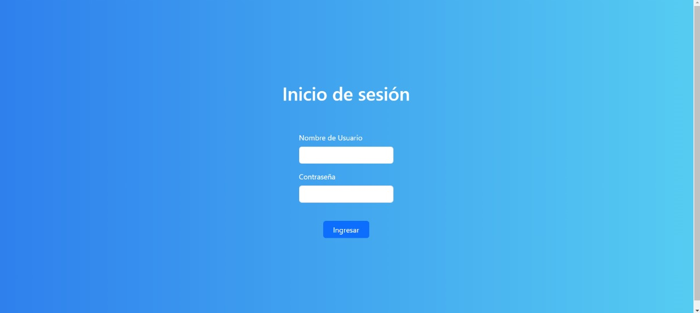
    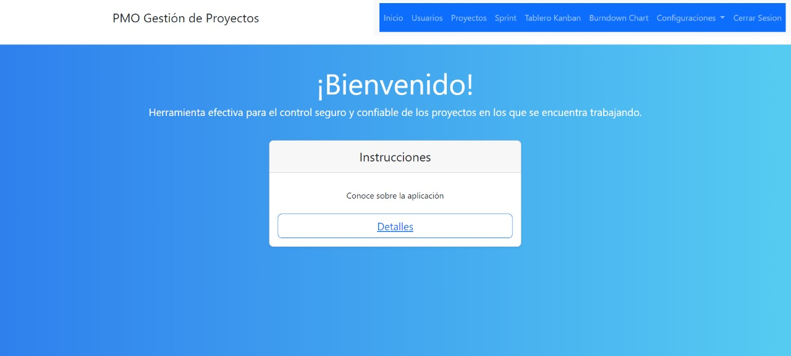
    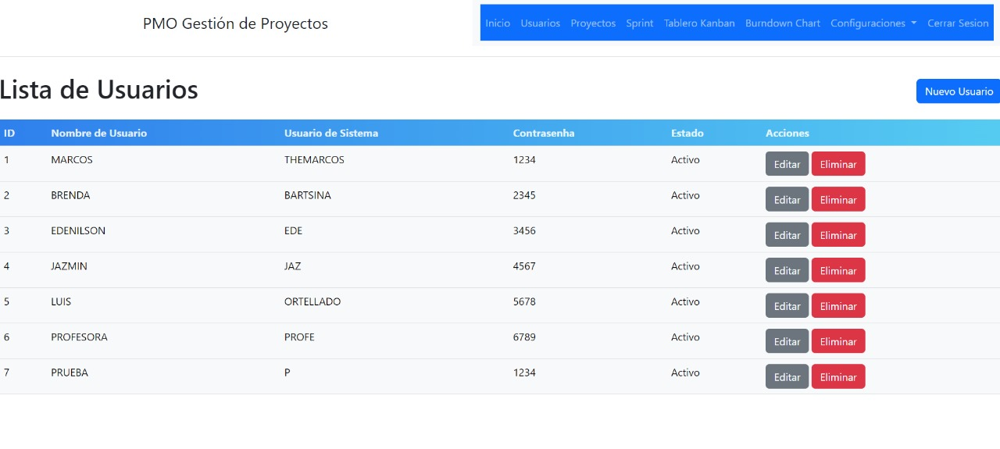
    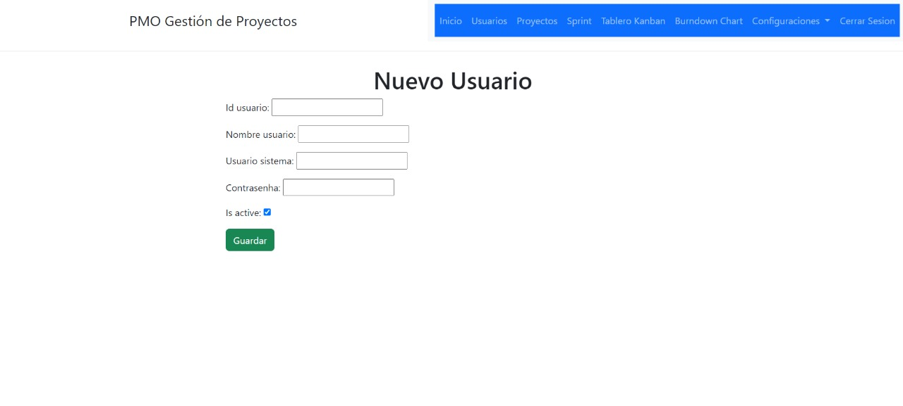
    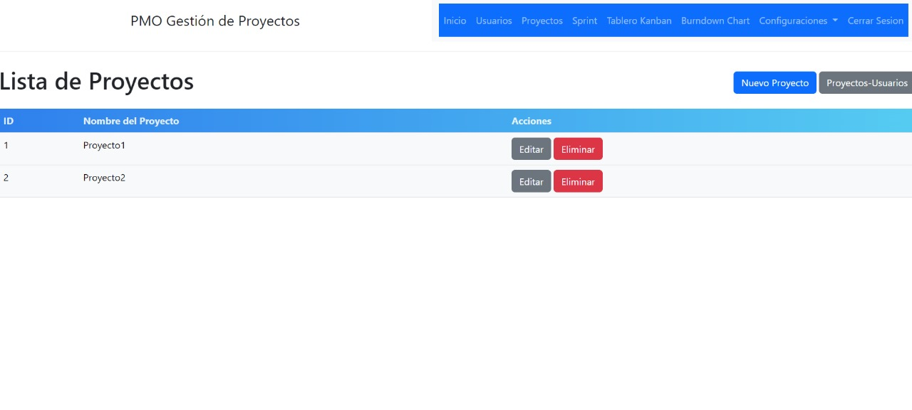
    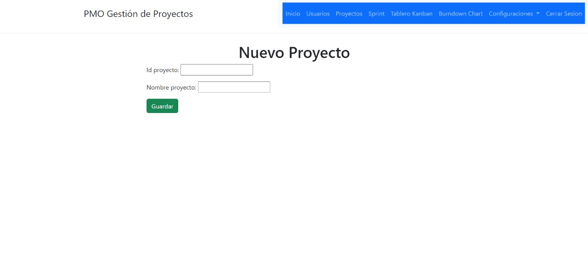
    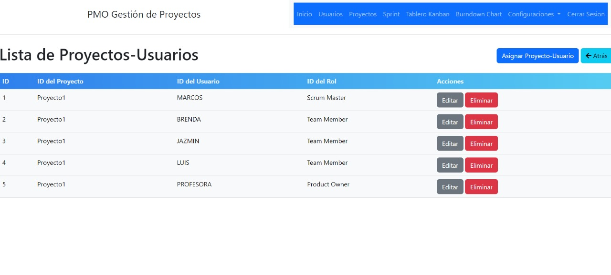
    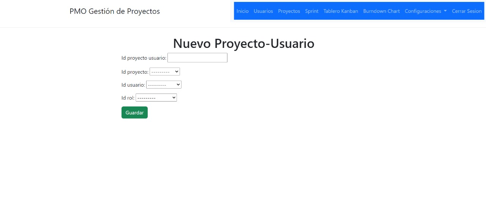
    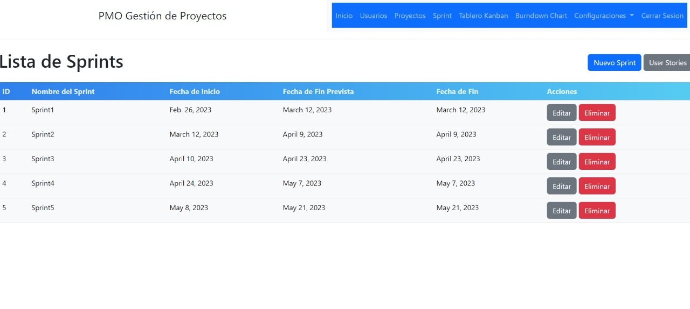
    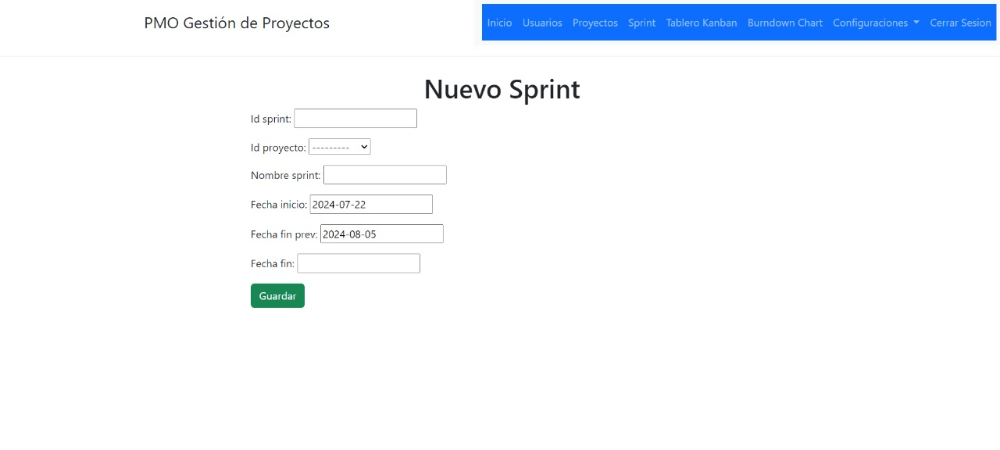
    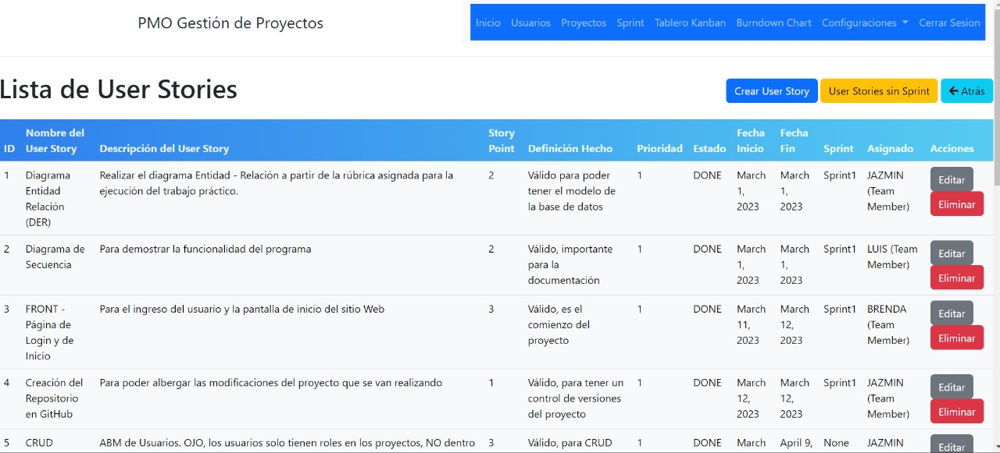
    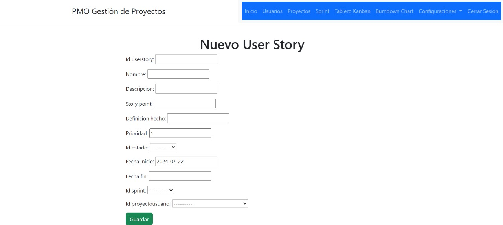
    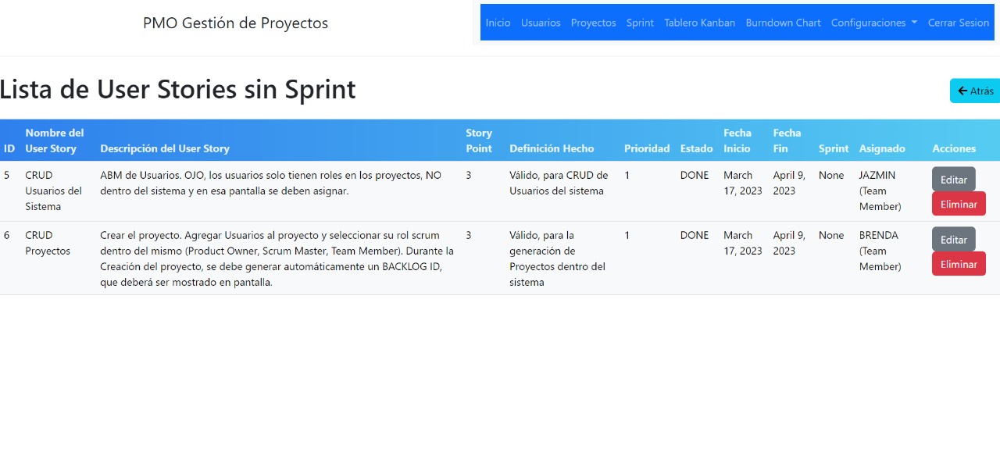
    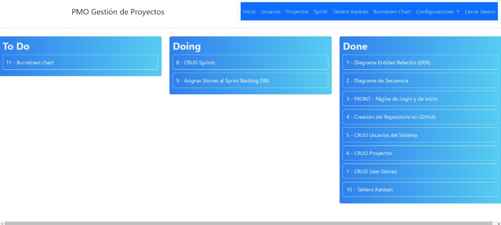
    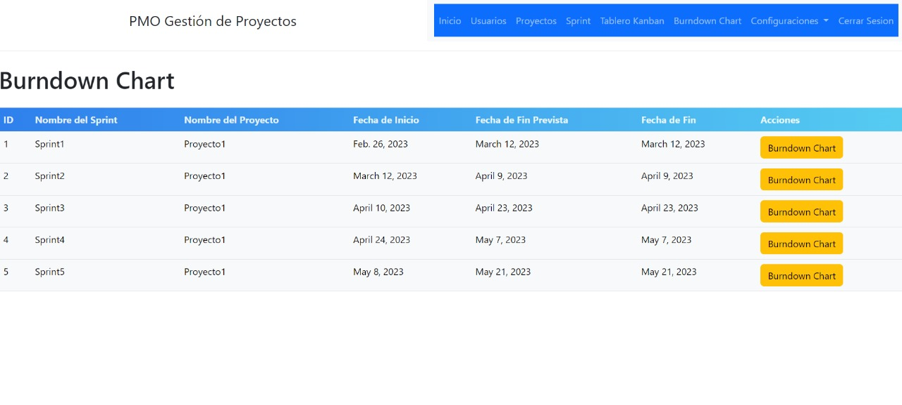
    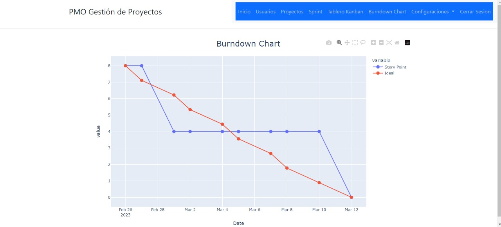
    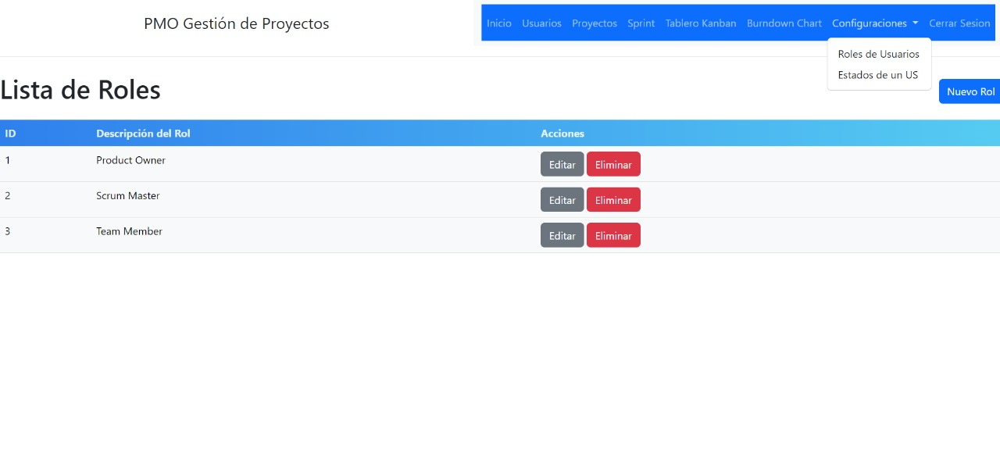
    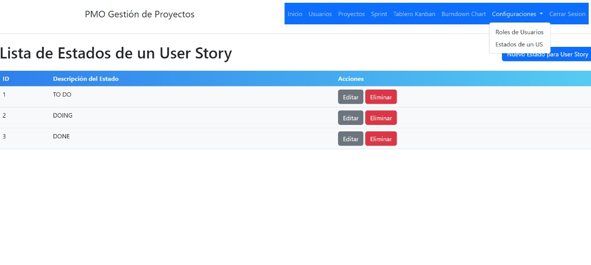
    <!-- Añadir más imágenes según sea necesario -->
</div>

## Insignia
<!-- Django, Python and PIP -->


<!-- Tools PEP 8 – Style Guide for Python Code -->


<!-- Python driver for PostgreSQL -->

<!-- Data visualization library for Python -->


<!-- Bootstrap CDN -->

<!-- License -->


## Project description
This project is a project management tool developed in Python using the Django framework. It is designed to facilitate the organization and monitoring of projects according to the SCRUM methodology and has an integrated Kanban board for viewing and managing tasks.

## Project Status
Developing

## App Features and Demo

# Sprint and Backlog Management:
 - Creation and management of sprints with start and end dates.
 - Product backlog management with task prioritization.

# Interactive Kanban Board:
 - Visualization and organization of tasks on a Kanban board.

# Data Visualization with Plotly:
 - Interactive graphs to visualize the progress of the project.
 - Burndown graphs to track sprint progress.
 - Equipment performance analysis using speed graphs and other metrics.

# Integration with PostgreSQL:
 - Robust and secure storage of project data using PostgreSQL.
 - Efficient and secure queries to recover and manage project data.

# User Interface with Bootstrap:
 - Stylized input forms and modals for creating and editing tasks and sprints.

<!--
# Notifications and Reminders:
 - Notification system to alert team members about important changes and upcoming events.
 - Automatic reminders for upcoming tasks and events.

# User Authentication and Authorization:
 - User registration and authentication.
 - Role and permission management for different team members (e.g. Product Owner, Scrum Master, Developer).
-->


## Project access

This project is a project management tool using the SCRUM methodology, featuring a Kanban board for task organization. It is built with Django and Python, utilizing Bootstrap for the frontend, Plotly for interactive graphs, and PostgreSQL as the database. Follow the steps below to get started with development.

### Recommended IDE Setup

[VSCode](https://code.visualstudio.com/) + [Python](https://marketplace.visualstudio.com/items?itemName=ms-python.python) + [autopep8](https://marketplace.visualstudio.com/items?itemName=ms-python.autopep8) + [Pylance](https://marketplace.visualstudio.com/items?itemName=ms-python.vscode-pylance) + [Python Debugger](https://marketplace.visualstudio.com/items?itemName=ms-python.debugpy) + [SQLTools](https://marketplace.visualstudio.com/items?itemName=mtxr.sqltools) 

### Customize configuration

See [Django Configuration Reference](https://docs.djangoproject.com/en/stable/topics/settings/).

### Project Setup - Install dependencies
Install Flask and update Python's pip:

```sh
pip install flask
```

### Install Django

```sh
pip install django
```

### Install and set up a virtual environment

```sh
pip install virtualenv
python -m venv env
```

### Install Plotly and Pandas for graphics

```sh
pip install plotly
pip install pandas
```

### Apply Migrations

```sh
python manage.py migrate
```

### Run the Development Server

```sh
python manage.py runserver
```

## Technologies
Django + Python\
autopep8 + pycodestyle\
PostgreSQL + psycopg2\
Plotly\
Bootstrap

## Contributors
Marcos González - Development\
Prof. Lilian Riveros - Review and feedback

## Developers
<!--Project Manager, Scrum Master, Team Lead, Web Developer, SEO Specialist and UX/UI Design-->
Marcos González - Web Developer, SEO Specialist and UX/UI Design

## License
This project is licensed under the MIT license. See the [LICENSE](LICENSE) file for more details.

## Conclusion
This project is dedicated to project management with SCRUM methodology, featuring a Kanban board for task organization. If you have any questions or comments, you can contact the project author at marcosdanielgg98@gmail.com. Or to the cell phone number: (+595)992-430-560